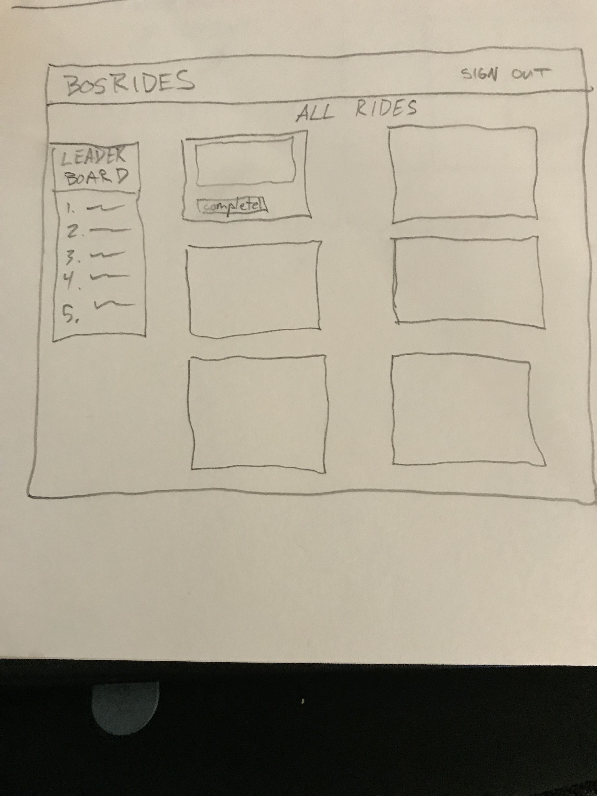
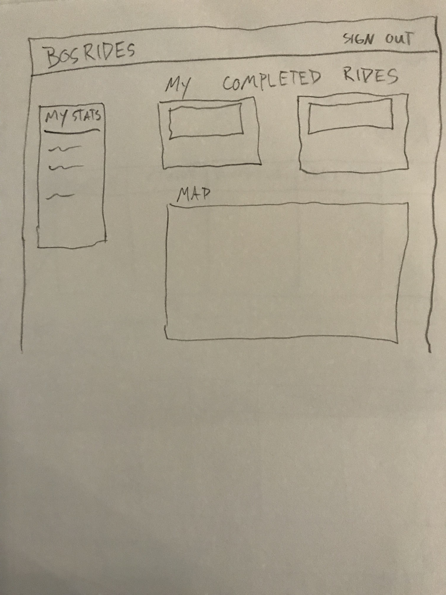

# BOSRide Client

## What is BOSRide?
BOSRide is all about getting you out for some exercise! Please sign up, then go ahead and choose one of the available rides after you have completed it, and it will be added to your Finished Rides. Add a quick note about how the ride went. You will be placed on a leaderboard with other users to see how you are doing! Feel free to update your finished ride details from the -more options- link on any of your finished rides.

It is a React-based front-end which communicates with a Rails API.

## Links to repos, front-end, and API:
### Front-end:
#### App:
https://dwbergstrom.github.io/ridegame-client/#/
#### Repo:
https://github.com/DWBergstrom/ridegame-client

### API:
#### App:
https://ridegame-api.herokuapp.com/
#### Repo:
https://github.com/DWBergstrom/ridegame-api

## Technologies used:
#### Front-end:
+ React
+ React Router
+ JavaScript
+ axios
+ lodash
+ SCSS
+ npm
+ Webpack

#### Third Party API:
+ Dark Sky weather API

##### Deployed on:
+ Github pages

#### API:
+ Ruby on Rails
+ PostgreSQL

##### Deployed on:
+ Heroku

## Planning and Process
I went through several project ideas before landing on this concept.  One challenge with the other project ideas was creating manageable resource relationships -- which this app does have.  In particular, there are three resources:  a user, rides, and finishes.  A user has many rides through finishes.

I also had planned for the features of this project to be "to-do" items on my second project, so it was nice to revisit some of those ideas with more knowledge, and to expand on the theme.

Lastly, I wanted to add a third party API of some kind, an decided upon the Dark Sky weather API due to its great documentation.

## Wireframes and entity relationship diagram:
#### Models and ERD

Models/Attributes:

Ride:
name:string photo_url:string description:string distance:integer points:integer
Rides are "static" in that they will be seeded to the database - not intended to be added by the user

Finish:
user:references ride:references notes:string date:date duration:integer

User:
email:string

ERD:
User has many rides through finishes
ERD:

Client Wireframes:

Final product:

### User stories
As a user, I can:
For auth:

- sign up, sign in, change password, and sign out

For main app functionality:

- click "completed" on a featured ride to add it to my finished rides
- remove a finished ride
- update the notes on a finished ride
- view all my finished rides and stats
- view my position on a leaderboard

React components:

- Ride
- Rides
- Finish
- Finishes
- Leaderboard

React routes:

- /rides
- /rides/:id
- /finishes
- /finishes/:id

Backend routes:

| Verb   | URI Pattern            | Controller#Action |
|--------|------------------------|-------------------|
| POST   | `/sign-up`             | `users#signup`    |
| POST   | `/sign-in`             | `users#signin`    |
| DELETE | `/sign-out`            | `users#signout`   |
| PATCH  | `/change-password`     | `users#changepw`  |
| GET    | `/rides`               | `rides#index`     |
| POST   | `/finishes`               | `finishes#create`    |
| GET    | `/finishes/:id`           | `finishes#show`      |
| PATCH  | `/finishes/:id`           | `finishes#update`    |
| DELETE  | `/finishes/:id`           | `finishes#destroy`    |

Client installation instructions:
1. fork and clone the client repo
2. cd into the repo directory and `npm install` to install dependencies
3. run `npm start` to start a local server
4. to deploy to prod, follow these steps:  https://github.com/gitname/react-gh-pages

API installation instructions:
1. fork and clone the api repo
2. cd into the repo directory and `bundle install` to install dependencies
3. set secret keys
3. run:
4. `bin/rails db:drop`
5. `bin/rails db:migrate`
6. `bin/rails server` to start locally
7. to deploy to prod, create a heroku app from this directory and push master code to heroku
8. add secret keys to heroku App

TODO:
+ implement google maps API
+ implement responsive design for smaller displays
+ Add notice on users Finishes page that they are in the lead!
